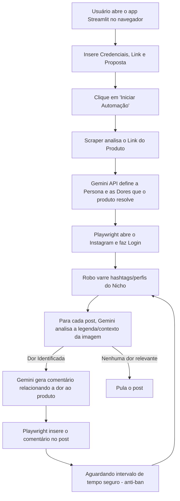

# Especificação de Requisitos e Fluxo - Robo_marketing

Este documento descreve os requisitos, a pilha de tecnologia e o fluxo do **Robo_marketing**, um robô de automação inteligente voltado para a divulgação direcionada de produtos digitais no Instagram usando **Streamlit**.

---

## 🎯 Objetivo Geral do Projeto
Desenvolver um robô com interface gráfica web local (Streamlit) que permita ao usuário inserir suas credenciais do Instagram, o link do produto a ser promovido e uma descrição da proposta de valor. 
O robô deve:
1. Analisar o site do produto para extrair a persona e entender os problemas/dores que ele resolve.
2. Navegar no Instagram simulando comportamento humano real de forma automatizada.
3. Localizar perfis e posts de interesse do nicho correspondente.
4. Identificar dores específicas relatadas nos posts (ex: motoristas de aplicativo reclamando de tarifas).
5. Gerar e publicar um comentário personalizado relacionando a dor identificada ao produto que está sendo promovido.

---

## 🛠️ Stack Tecnológica
* **Interface Gráfica (GUI):** `Streamlit` (Página web local gerada 100% em Python, visual moderno e ágil).
* **Automação Web:** `Playwright` (Persistência de cookies e sessões de navegador local para simular navegação humana segura).
* **Inteligência Artificial (IA):** API do Google Gemini (para análise semântica da proposta do site, mapeamento de dores nos posts e geração contextual do comentário personalizado).
* **Web Scraping:** `BeautifulSoup4` + `requests` (para leitura e processamento rápidos do site do produto).
* **Testes:** `pytest` + `unittest.mock` (para validação segura e isolada do sistema).

---

## 🚀 Fluxo de Funcionamento Interno

---

## 🔒 Boas Práticas e Segurança (Anti-Ban)
* **Persistência de Cookies:** Usar perfis de contexto persistentes no Playwright para evitar logins repetitivos.
* **Intervalos Dinâmicos (Delays):** Intervalos de tempo aleatórios entre as interações humanas simuladas.
* **Limites Diários:** Restrição de quantidade máxima de comentários diários configuráveis pelo usuário na tela.
